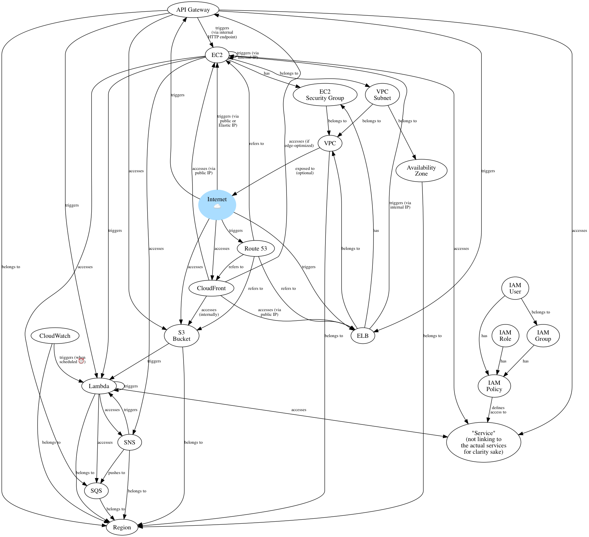

# AWS Diagram

A simple diagram showing the common relationships between the most popular AWS services.



## Usage

```bash
$ brew install graphviz node
$ npm install
$ npm run build
$ open diagram.png
```

## Development

```bash
$ npm run watch
```

## TODO

- ECS
- ElastiCache
- RDS
- DynamoDB
- Step Functions?