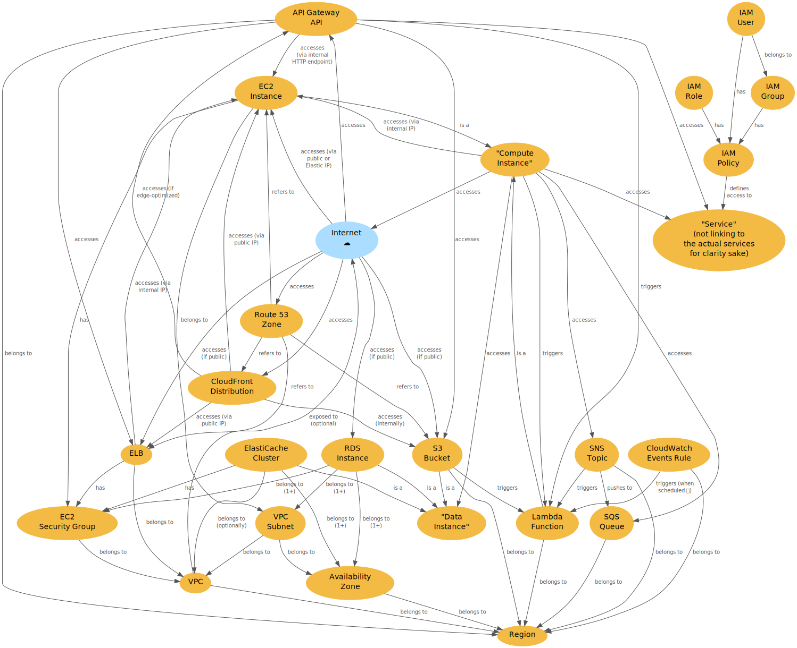

# AWS Diagram

A simple diagram showing the common relationships between the most popular AWS services.



## Usage

Install the [Roboto Mono](https://fonts.google.com/specimen/Roboto+Mono) font.

```bash
$ brew install graphviz node
$ npm install
$ npm run build
$ open diagram.png
```

## Development

```bash
$ npm run watch
```

## TODO

- Services: ECS, ElastiCache, RDS, DynamoDB, Step Functions?
- Paint services according to their type ("Compute", "Storage", "Network & Content Delivery", ... see grouping in AWS Console)

## Reference

- [Drawing graphs with (Graphviz) dot](https://graphviz.gitlab.io/_pages/pdf/dotguide.pdf)